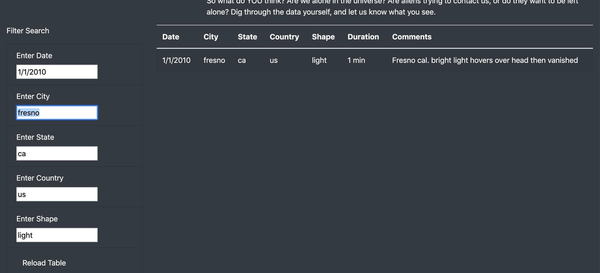

# UFO
### Overview:
    
   To develop a webpage page which can list the Unidentified Flying Objects sightings based on data from NASA. Since the list is going to be quite a big have a provision to filter based on the date of the UFO sightings reported.
   
### Technology: 
   1. HTML
   2. Bootstrap & CSS 
   3. Javascript
   4. d3 JS for handling events from webpage and rendering dynamic content
 
 ### Description:
 
   Developed a responsive webpage with a Bootstrap grid system with multiple rows. The first row being the Navigation Bar with a link to other pages in our case just the UFO sightings page. The second row will contain Title Banner of the page you are viewing or clicked from the navigation bar. The third row contains two sections or columns, the first column contains the heading and the second column contains description or paragraph describing the details. 
   
   Final row contains the most important part of the webpage UFO sighting details with two columns, the right column has provision to filter the data based on the date it's reported and a button to submit the filter request. The left column contains the UFO sightings data with Country, city, state the UFO sightings were reported along with the date and shape of the UFO. If you are interested in specific UFO sightings based on a specific date you should be able to enter the date and filter it out.
   
   The webpage is designed in such a way it can adapt to a different device and screen resolution using Bootstrap stylesheet. The filtering of the data and rendering the filtered data is accomplished using the d3 js framework. Using d3 we have attached a listener for on click event on Filter Button, once the click event happens we filter the data using the data entered and rebuild the table data dynamically.
    
## Challenge:

### Overview:

   Enhance the webpage to include additional filters for narrowing down the UFO sightings data based on Country, City, State, Shape of the UFO along with the date.
   
### Description:

   Using a challenge event for the filtered fields we developed the webpage to capture the change as the user changes the filter data and filtered the UFO sighting data and rebuild the table. Also filtered data only if all the values entered matches similar to SQL AND condition. If all the filter fields are entered like Country, City, State, Shape, and Date we render the data only if it matches all the value entered if not an empty table is rendered. 
   
   Additionally provided the Reload Data button to refresh the data table to bring the original UFO sightings data and to reset the filter field (reset filters).
